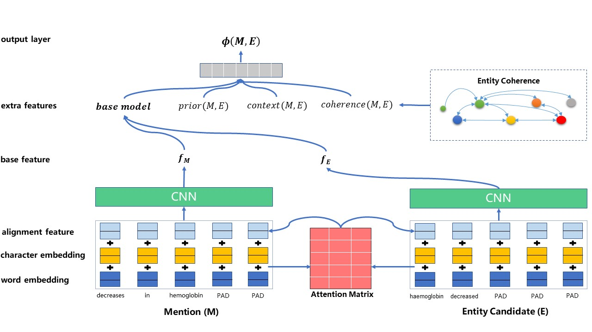

# Biomedical-Entity-Linking


## Environment setup
Clone the repository and set up the environment via "requirements.txt". Here we use python3.6. 
```
pip install -r requirements.txt
```
## Data preparation
**Dataset.** We valid our model on three datasets, ShARe/CLEF, NCBI and ADR. Download these dataset and their corresponding knowledge bases following the urls below.
| Dataset | Reference KB  |
|------|------|
| [NCBI disease](https://www.ncbi.nlm.nih.gov/CBBresearch/Dogan/DISEASE/) | [MEDIC (July 6, 2012)](http://ctdbase.org/downloads/#alldiseases) |
| [ShARe/CLEF eHealth 2013 Challenge](https://physionet.org/content/shareclefehealth2013/1.0/) | [SNOMED-CT (UMLS 2012AA)](https://www.nlm.nih.gov/pubs/techbull/mj12/mj12_umls_2012aa_release.html)|
| [TAC 2017 ADR](https://bionlp.nlm.nih.gov/tac2017adversereactions/) | [MedDRA (18.1)](https://www.meddra.org/) |

**Word Embedding.** 
In our experiments, we represent each word by a 200-dimensional word embedding computed on PubMed and
MIMIC-III corpus, which is proposed in this paper[1]. [Downlaod](https://github.com/ncbi-nlp/BioSentVec).
After downloading, put the embedding file in the path `Biomedical-Entity-Linking/input/` 

**Extra Biomedical documents.**
entities in the same document have a co-occurrence relationship to some extent,
which can be used to enhance entity liking. To capture this relationship among entities, we adopt the
method of pre-trained entity embedding. More specifically, we treat each entity occurring in the same
document as a single word. Hence, each document can be represented as a sentence and each word in it is
an entity. Then utilizing the word2vec model to get pre-trained entity embeddings
so that entities often co-occur together have a similar distributed representation.
Here, the medical corpus we adopt is a collection of PubMed abstracts
which can be obtained at *ftp://ftp.ncbi.nlm.nih.gov/pubmed/baseline/*

## Evaluation
First you can use `-help` to show the arguments
```
python train.py -help
```
Once completing the data preparation and environment setup, we can evaluate the model via `train.py`.
We have also provided datasets after preprocessing, you can just run the mode without downloading.
```
python3 train.py -dataset ncbi
```

**Using Optimal Parameters**
1. NCBI datast
```
python train.py -dataset ncbi -hinge 0.15 
```
2. ShARe/CLEF dataset
```
python train.py -dataset clef -hinge 0.30 -voting_k 15 -alpha 0.6 
```
3. ADR dataset
```
python train.py -dataset adr -hinge 0.10 -voting_k 10  
```
**Adding Features**
1. add context
```
python train.py -dataset ncbi -add_context True
```
2. add coherence
```
python train.py -dataset ncbi -add_coherence True
```
**Result**


## Reference
[1] Zhang Y, Chen Q, Yang Z, Lin H, Lu Z. BioWordVec, improving biomedical word embeddings with subword information and MeSH. Scientific Data. 2019.
